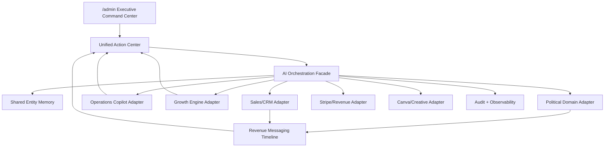

# HomeReach Ecosystem Master Expansion Audit

Audit date: 2026-05-18  
Scope: Phase 1 audit and consolidation strategy only. No runtime feature implementation was performed in this phase.

## Executive Summary

HomeReach already contains most of the building blocks requested in the master expansion prompt: admin command surfaces, revenue messaging, sales CRM, political command, candidate agents, Growth OS, Growth Engine, SEO Engine, Operations Copilot procurement, Canva design orchestration, Q&A, AI intake, Stripe flows, Twilio/Postmark/Facebook webhooks, and multiple agent APIs.

The primary platform risk is not missing capability. The risk is overlap:

- Multiple command-center style admin pages exist.
- Multiple AI/agent systems exist.
- Multiple communication/event stores exist.
- Multiple growth/content systems exist.
- Multiple procurement entry points exist.
- Political has public, admin, candidate-agent, map, campaign, proposal, and presentation surfaces that must remain connected.
- Migrations are split between two roots and must be treated carefully.

The right next move is not to build another dashboard. The right move is to create a unified orchestration layer that reads from existing systems through adapters, keeps each protected flow intact, and gradually makes one command center the executive surface.

## Current Repository Shape

Root:

`C:\Users\jason\OneDrive\Documents\Claude\Projects\HomeReach Platform Rebuild\homereach`

Detected stack:

- Monorepo using pnpm/Turbo.
- Primary app: `apps/web`, Next.js App Router.
- Shared packages: `packages/db`, `packages/services`, `packages/types`.
- Supabase/Postgres and Drizzle schemas.
- Stripe, Twilio, Mailgun/Postmark/Resend, Facebook, Canva, FEC/OpenFEC, Google Civic, OpenAI/Anthropic integration points.

Route inventory from disk:

- 351 `page.tsx`, `route.ts`, or `layout.tsx` files under `apps/web/app`.
- 185 API route files under `apps/web/app/api`.
- 142 admin route/layout files under `apps/web/app/(admin)`.
- 31 public political route/layout files.
- 17 funnel route/layout files.
- 13 agent portal route/layout files.
- 9 client dashboard route/layout files.
- 7 Operations Copilot route/layout files.
- 7 Growth OS route/layout files.

## Existing Major Systems

### Public Revenue + Customer Journey

Existing surfaces:

- `/`
- `/get-started`
- `/get-started/[citySlug]`
- `/get-started/[citySlug]/[categorySlug]`
- `/spots/[citySlug]/[categorySlug]`
- `/shared-postcards`
- `/shared-postcards/ai-intake`
- `/targeted`
- `/targeted/start`
- `/targeted/intake`
- `/targeted/checkout`
- `/checkout/success`
- `/dashboard`
- `/campaign`
- `/replies`
- `/billing`
- `/settings`

Protected flows:

- Homepage CTA to funnel.
- City/category exclusivity and spot availability.
- Shared postcard AI cart intake.
- Stripe spot checkout.
- Targeted campaign checkout.
- Client dashboard.
- Intake token flow.

### Admin + Revenue Operations

Existing admin navigation already includes:

- `/admin` Command Center.
- `/admin/sales-dashboard` Sales Intelligence.
- `/admin/inbox` Communications.
- `/admin/agents` AI Workforce.
- `/admin/control-center` Control Center.
- `/admin/crm` CRM.
- `/admin/revenue-operations` Revenue Command.
- `/admin/procurement` Procurement.
- `/admin/businesses`
- `/admin/orders`
- `/admin/profit-center`
- `/admin/pricing`
- `/admin/founding`
- `/admin/spots`
- `/admin/ai-intake`
- `/admin/targeted-campaigns`
- `/admin/political`
- `/admin/political/maps`
- `/admin/ad-designer`
- `/admin/canva`
- `/admin/leads`
- `/admin/sales-engine`
- `/admin/operator`
- `/admin/war-room`
- `/admin/facebook`
- `/admin/growth-engine`
- `/admin/growth`
- `/admin/traffic-engine`
- `/admin/roi-preview`

Implication: do not add a separate “Unified HomeReach Command Center” route. The safest path is to enhance `/admin` as the executive layer and use `/admin/revenue-operations`, `/admin/procurement`, `/admin/political`, `/admin/growth-engine`, and `/admin/agents` as drill-downs.

### Political Command

Existing surfaces:

- `/political`
- `/political/plan`
- `/political/maps`
- `/political/pricing`
- `/political/routes`
- `/political/calendar`
- `/political/simulator`
- `/political/analytics`
- `/political/data-sources`
- `/political/candidate-agent`
- `/political/presentation`
- `/admin/political/*`
- `/p/[token]`
- `/c/[token]`

Existing political layout now exposes:

- `Chat with Campaign AI Agent`
- `Start Campaign Mail Plan`
- signed-in logout button
- public political nav
- floating political agent button

Existing political data/model areas:

- Core political candidates/campaigns/proposals/orders.
- Political map and plan intelligence.
- Candidate launch agents.
- Multi-candidate creative engine migration.
- Candidate intelligence ingestion.
- SerpAPI provider is manually paused by default.

Protection notes:

- Political checkout/proposal and Stripe flows must stay human-approved.
- Political recommendations must remain aggregate/geographic/logistics-based.
- No individual ideology or persuasion scoring should be introduced.

### Procurement + Inventory

Existing surfaces:

- `/operations-copilot`
- `/operations-copilot/supplier-prices`
- `/operations-copilot/supplies`
- `/operations-copilot/delivery`
- `/operations-copilot/approvals`
- `/operations-copilot/data`
- `/inventory-purchasing`
- `/inventory-purchasing/dashboard`
- `/admin/procurement`

Existing schema areas:

- `opcopilot_business_contexts`
- `opcopilot_inventory_items`
- `opcopilot_suppliers`
- `opcopilot_supplier_quotes`
- `opcopilot_price_snapshots`
- `opcopilot_ai_events`
- `opcopilot_action_requests`

Implication: procurement should consolidate around Operations Copilot as the domain engine, with `/admin/procurement` as admin visibility and `/operations-copilot` as customer-facing command.

### Outreach + Communication

Existing systems:

- Legacy `outreach_contacts`, `campaigns`, `outreach_messages`, `outreach_replies`.
- `conversations` table and `/api/conversations/*`.
- `sales_leads` and `sales_events`.
- `/api/admin/sales/event` sends/logs SMS, email, and Facebook actions.
- `/api/webhooks/outreach/sms` inbound SMS.
- `/api/webhooks/twilio/status` status callback.
- `/api/webhooks/postmark` email event observability.
- `/api/webhooks/facebook` and `/api/facebook/*`.
- New `revenue_message_threads` and `revenue_message_events` bridge from migration `093_revenue_messaging_engine.sql`.
- `apps/web/lib/revenue-messaging/outbound.ts`
- `apps/web/lib/revenue-messaging/inbound.ts`

Recommendation: make `revenue_message_threads` and `revenue_message_events` the canonical unified messaging timeline. Keep legacy tables intact and bridge them forward through existing inbound/outbound adapters.

### AI + Agents

Existing AI/agent surfaces:

- `/admin/agents`
- `/api/admin/agents/*`
- `/api/admin/system/agents/*`
- `/api/admin/system/apex`
- `/api/admin/system/pause`
- `/api/agent/*`
- `apps/web/lib/ai/llm.ts`
- `apps/web/lib/engine/automation.ts`
- Growth OS AI chat/recommendations.
- Operations Copilot chat/intelligence.
- Political candidate launch agent.
- QA system.
- Content Intelligence.
- SEO draft generation.
- AI intake shared-postcard cart.

Recommendation: create a single orchestration facade that calls the existing domain agents rather than replacing them. The facade should define common concepts: entity, memory, recommendation, action, approval, audit event, and safety mode.

### Growth + SEO + Content

Existing surfaces:

- `/admin/growth-engine`
- `/admin/growth`
- `/growth-os/*`
- `/api/admin/growth-engine/*`
- `/api/admin/seo-engine/*`
- `/api/growth-os/*`
- Content Intel APIs and admin page.
- Lead Intel APIs.
- SEO engine with feature flags.
- Growth Engine blueprint already contains ARVOW/BLOTATO/RSS placeholders.

Recommendation: Growth Engine should become the planning/review queue for content and SEO, not a separate customer command center. It should feed the unified admin action center with “needs review / ready to publish / blocked” items.

### Canva + Creative

Existing Canva pieces:

- `/admin/canva`
- `/api/admin/canva/*`
- `apps/web/lib/canva/*`
- Brand system, folder definitions, template definitions, prompt frameworks, OAuth config.
- Migration `092_canva_primary_design_engine.sql`.

Recommendation: keep Canva as the primary design execution layer, but route requests through the AI orchestration facade so political decks, postcards, Growth Engine assets, and sales proposals share a consistent design policy.

## Database + Migration Map

Drizzle schema index currently exports:

- users
- cities
- products
- businesses
- orders
- outreach
- misc
- intake
- leads
- targeted
- political
- politicalMap
- politicalIntelligence
- politicalLaunchAgent
- conversations
- sales
- growth
- fsgos
- opcopilot
- aiIntake
- twilioObservability
- emailObservability

Migration roots:

- `packages/db/supabase/migrations`: legacy/early migrations `00` through `32`.
- `supabase/migrations`: later operational migrations `045` through `093`.

Recent critical migrations:

- `085_operations_copilot_core.sql`
- `086_outreach_owner_controls.sql`
- `087_opcopilot_price_snapshots.sql`
- `088_candidate_intelligence_ingestion.sql`
- `089_political_candidate_launch_agents.sql`
- `090_ai_intake_agent.sql`
- `091_political_multi_candidate_creative_engine.sql`
- `092_canva_primary_design_engine.sql`
- `093_revenue_messaging_engine.sql`

Risk: migration numbering and ownership are split. Future schema changes should use the root `supabase/migrations` stream unless a deliberate migration reconciliation is performed.

## Integration Map

Configured or referenced integrations:

- Supabase Auth/Postgres/service role.
- Stripe Checkout and webhook.
- Twilio SMS outbound, inbound, and status callbacks.
- Mailgun sending in several sales/admin routes.
- Resend sending via shared outreach service.
- Postmark sending helper and webhook observability.
- Facebook/Meta webhook, page token, auto-reply gates.
- Canva Connect OAuth/API.
- FEC/OpenFEC.
- Google Civic API.
- OpenAI and Anthropic via shared and feature-specific clients.
- SerpAPI candidate enrichment, gated by `ENABLE_CANDIDATE_SERPAPI` and `SERPAPI_PAUSED`; scraper route also has a hard manual pause lock.
- SEO/social placeholders: Arvow, Blotato, RSS/CMS webhook envs.

## Duplication And Conflict Findings

| Area | Existing overlap | Operational impact | Recommended path |
| --- | --- | --- | --- |
| Command center | `/admin`, `/admin/control-center`, `/admin/revenue-operations`, `/admin/operator`, `/admin/war-room`, `/admin/agents` | Admin can lose the “one next action” view. | Make `/admin` the executive surface; keep others as drill-down workspaces. |
| Messaging | legacy outreach tables, conversations, sales events, revenue messaging, provider webhooks | Replies and send history can fragment. | Canonicalize new timeline on `revenue_message_threads/events`; bridge legacy sends/replies into it. |
| AI agents | admin agents, system agents, Growth OS, Operations Copilot, political agents, QA, SEO/content AI | Parallel memory and recommendations. | Add orchestration facade and shared memory; keep domain agents as workers. |
| Growth/content | Growth Engine, Growth OS, SEO Engine, Content Intel, Lead Intel | Publishing and review queues can split. | Use Growth Engine as review/planning queue; feed actions to admin action center. |
| Procurement | Operations Copilot public routes, inventory aliases, admin procurement | Multiple entry points to same idea. | Operations Copilot is domain source; admin procurement is visibility layer. |
| Political | public command, admin political, candidate-agent, maps, proposal, presentation | Risk of adding disconnected campaign tools. | Candidate-agent and political maps remain source; strategy/deck/creative features should use existing political data and proposal/order flows. |
| Email providers | Mailgun, Resend, Postmark | Reputation and event tracking can split. | Define provider policy: one transactional sender, one outreach sender, Postmark/Mailgun observability bridge. |
| Payments | spots checkout, targeted checkout, intelligence checkout, political checkout | Each flow has different readiness/metadata behavior. | Preserve flows; add a revenue path monitor instead of replacing checkout. |
| Migrations | `packages/db/supabase/migrations` and root `supabase/migrations` | Drift risk. | Freeze old root as historical; continue new changes in root `supabase/migrations`. |

## Proposed Unified Architecture

Do not create a new standalone mini-app. Add a thin orchestration layer:

### Core Concepts

- Entity: business, lead, campaign, candidate, supplier, customer, order, proposal.
- Memory: persisted facts, preferences, prior actions, objections, approvals, selected creative, billing status.
- Recommendation: proposed action with confidence, evidence, risk level, business line, owner.
- Action: a reversible next step: approve, send, draft, checkout, order, schedule, review, publish.
- Approval: explicit human checkpoint for high-risk actions.
- Audit event: immutable record of what system/agent/user did and why.

### Canonical Domain Sources

| Domain | Source of truth | Executive view |
| --- | --- | --- |
| Shared postcard revenue | businesses/orders/spot assignments/intake | `/admin` revenue cards and `/admin/spots` detail |
| Targeted campaigns | leads/targeted_route_campaigns/sales events | `/admin/revenue-operations`, `/admin/targeted-campaigns` |
| Political | campaign_candidates/political_* tables/candidate agents | `/admin/political`, `/political/candidate-agent` |
| Procurement | opcopilot_* tables | `/operations-copilot`, `/admin/procurement` |
| Messaging | revenue_message_threads/events with legacy bridges | `/admin/inbox`, `/admin/revenue-operations` |
| Growth/content | growth_engine/seo/content-intel structures | `/admin/growth-engine` |
| Creative | Canva config/templates plus postcard/creative records | `/admin/canva`, political creative views |
| Payments | Stripe sessions/webhook/order/proposal records | `/admin/orders`, `/admin/profit-center` |

## Safe Implementation Strategy

### Phase 1 Complete: Audit And Strategy

This document is the audit artifact. No runtime behavior changed.

### Phase 2: Executive Adapter Layer

Lowest-risk next implementation:

- Add `apps/web/lib/homereach-command/` with read-only adapters.
- Aggregate existing metrics into a single normalized `CommandCenterSnapshot`.
- Use existing tables and APIs only.
- No new DB table required for the first slice.
- Render snapshot on `/admin` only.

### Phase 3: Unified Action Center

- Normalize existing “things requiring attention” into `CommandAction` objects.
- Sources: revenue messaging hot replies, procurement approvals, political readiness, Growth Engine review queue, failed payments, Stripe/order issues.
- Actions should link to existing detail pages, not duplicate them.

### Phase 4: Shared Memory Layer

- Add an additive table only after the read-only adapter proves useful.
- Proposed table: `homereach_entity_memory`.
- Each row should store entity type/id, memory category, fact, source, confidence, freshness, created_by, and audit metadata.
- Do not store secrets or provider credentials.

### Phase 5: AI Orchestration Facade

- Add a single server-side orchestrator that delegates to existing domain agents.
- Use `apps/web/lib/ai/llm.ts` for provider selection.
- Political mode must remain draft/human-approval by default.
- Procurement and local-business outreach can later support assisted autopilot, behind feature flags.

### Phase 6: Communication Canonicalization

- Continue bridging sends and replies into `revenue_message_threads/events`.
- Show all channels in `/admin/inbox`.
- Do not delete legacy tables.
- Build duplicate-send prevention and suppression checks at the facade layer.

### Phase 7: Operational Hardening

- API auth guard audit for `/api/admin/*`.
- Stripe revenue path monitor.
- Feature flag registry.
- Migration reconciliation checklist.
- Provider policy and webhook verification.

## Protected Flows

Do not replace these flows directly:

- `/get-started` funnel.
- `/spots/*` checkout.
- `/api/spots/availability`.
- `/api/spots/checkout`.
- `/api/stripe/*`.
- `/api/webhooks/stripe`.
- `/targeted/*` checkout/intake.
- `/political/*` public dashboard.
- `/admin/political/*`.
- `/operations-copilot/*`.
- `/api/webhooks/outreach/sms`.
- `/api/webhooks/twilio/status`.
- `/api/webhooks/postmark`.
- `/api/webhooks/facebook`.
- Supabase auth layouts and middleware.

## Immediate Risks To Address

1. API admin auth is not fully enforced by middleware; each route must be verified individually.
2. Migration roots remain split and should not be extended casually in both places.
3. Multiple email providers are live in code without one explicit production policy.
4. Political payment reconciliation should be webhook-backed, not only success-redirect-backed.
5. The worktree is heavily dirty from several workstreams; stage and deploy only reviewed, intentional files.
6. SerpAPI must remain paused unless explicitly re-enabled by the owner.
7. Local development inside OneDrive remains a reliability risk for watchers and dependency traversal.

## Owner Action Items To Finalize Platform Readiness

- Apply/verify Supabase migration `093_revenue_messaging_engine.sql`.
- Verify migrations `085`, `086`, `087`, `088`, `089`, `090`, `091`, and `092` are applied in production before turning related UI fully live.
- Confirm Vercel production envs for Supabase, Stripe, Twilio, email provider, Canva, OpenAI/Anthropic, and feature flags.
- Choose production email policy: Resend vs Mailgun vs Postmark for outbound; keep Postmark/Mailgun webhooks as configured only if credentials are present.
- Confirm Twilio A2P/10DLC before prospecting SMS.
- Point Twilio inbound SMS to `/api/webhooks/outreach/sms`.
- Point Twilio status callback to `/api/webhooks/twilio/status`.
- Decide when, if ever, to re-enable SerpAPI; keep `SERPAPI_PAUSED=true` until then.
- Approve political outreach disclaimers/templates before any sends.
- Confirm which branch/files should be staged, because the worktree contains many unrelated changes.

## Recommended Next Implementation Slice

Build the read-only executive adapter layer:

1. `apps/web/lib/homereach-command/types.ts`
2. `apps/web/lib/homereach-command/snapshot.ts`
3. `apps/web/components/homereach-command/executive-command-center.tsx`
4. Update `/admin` to render the snapshot above existing admin modules.

This gives the “one elite ecosystem” experience without replacing existing dashboards, changing payments, changing messaging sends, or adding new schema.

